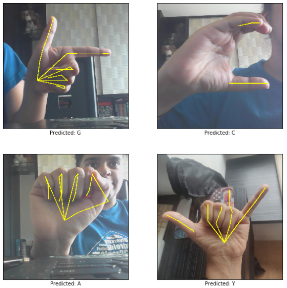

# ISL-Detection
Detecting Indian Sign Language using a HandPose model. For now, it detects all the alphabets.

## Using HandPose
Most sign language detection models prefer using Skin Segmentation for preprocessing. However, there are a lot of limitations to this method, like lighting issues, different skin tones, and distinguishing hand skin from any other skin.

A better approach would be to use the <a href = "https://ai.googleblog.com/2019/08/on-device-real-time-hand-tracking-with.html"> MediaPipe</a> model. The idea here is to extract the skeleton and build a CNN model with this data. Here, the code and model was adapted from <a href = "https://github.com/spmallick/learnopencv/tree/master/HandPose"> LearnOpenCV's HandPose repo.</a>

## Prediction
After training the model, it can detect any ISL single-handed alphabet, by first extracting its keypoints, and passing its skeleton through the CNN model. 

## Limitations

### 1. Bad Dataset
There are lack of good quality ISL datasets available online. The lack of quality leads to the HandPose not being able to find any keypoints, hence training a poor model.

### 2. Restricted to Single-Handed ISL
Again, due to a lack of quality ISL datasets - there aren't any Double-Handed ISL datasets freely available. Single-Handed ISL is very similar to American Sign Language (ASL) and won't be as practically useful as Double-Handed ISL is used more.

## Future Work
[ ] Training model to recognize numbers
[ ] Training model to recognize words (through <b>Gesture Recognition</b>)
[ ] Applying the model to Livestream Data, making this a Live-Time ISL detection system
